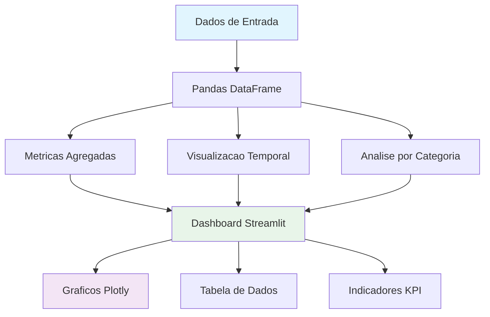
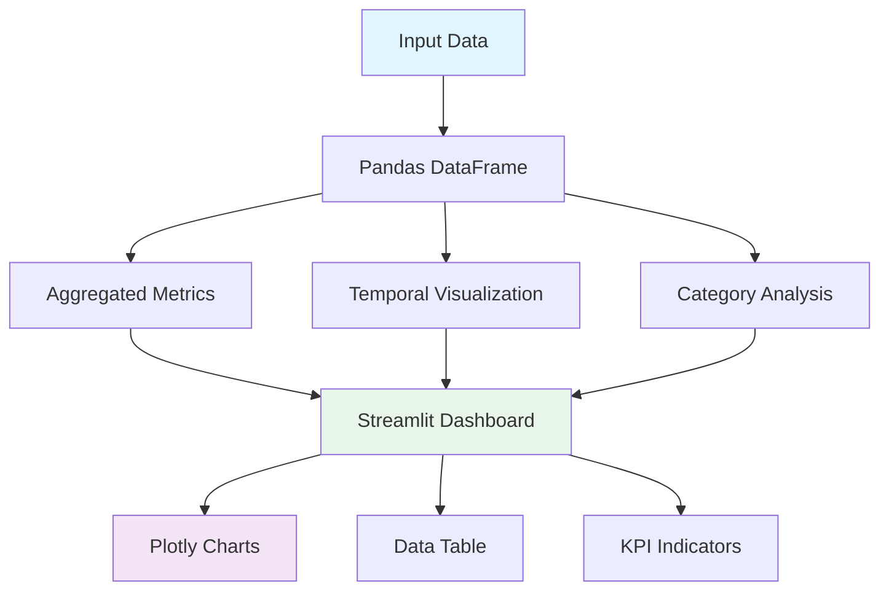

<div align="center">

# IBM Generative AI Engineering Capstone

[](https://python.org)
[](https://streamlit.io/)
[](https://plotly.com/)
[](https://scikit-learn.org/)
[](Dockerfile)
[](LICENSE)

Projeto capstone do IBM Generative AI Engineering Professional Certificate -- aplicacao Streamlit para exploracao de dados e visualizacao interativa de metricas.

Capstone project from the IBM Generative AI Engineering Professional Certificate -- Streamlit application for data exploration and interactive metrics visualization.

[Portugues](#portugues) | [English](#english)

</div>

---

<a name="portugues"></a>
## Portugues

### Sobre

Este projeto foi desenvolvido como capstone da certificacao profissional IBM Generative AI Engineering. A aplicacao consiste em um dashboard interativo construido com Streamlit que demonstra tecnicas de exploracao de dados, visualizacao de series temporais e analise de categorias. O projeto aborda conceitos de engenharia de dados para aplicacoes de inteligencia artificial generativa, incluindo preparacao de datasets, calculo de metricas agregadas e construcao de interfaces visuais para analise de resultados. A documentacao inclui guia de etica para uso responsavel de modelos generativos.

### Tecnologias

| Tecnologia | Descricao |
|---|---|
| Python 3.12 | Linguagem principal |
| Streamlit | Framework para dashboard interativo |
| Plotly | Graficos interativos (linhas, barras) |
| Pandas | Manipulacao e analise de dados |
| NumPy | Computacao numerica |
| scikit-learn | Metricas e avaliacao |

### Arquitetura



### Estrutura do Projeto

```
ibm-generative-ai-engineering-capstone/
├── src/
│   └── main_platform.py            # Dashboard Streamlit principal
├── tests/
│   ├── __init__.py
│   ├── performance_test.py
│   └── test_platform.py
├── docs/
│   ├── api_reference.md
│   ├── development_guide.md
│   └── ethics_guidelines.md
├── Dockerfile
├── requirements.txt
├── LICENSE
└── README.md
```

### Inicio Rapido

```bash
# Clonar o repositorio
git clone https://github.com/galafis/ibm-generative-ai-engineering-capstone.git
cd ibm-generative-ai-engineering-capstone

# Criar ambiente virtual
python -m venv venv
source venv/bin/activate  # Windows: venv\Scripts\activate

# Instalar dependencias
pip install -r requirements.txt

# Executar dashboard
streamlit run src/main_platform.py
```

### Docker

```bash
docker build -t ibm-generative-ai-capstone .
docker run -p 8501:8501 ibm-generative-ai-capstone
```

### Testes

```bash
pytest
pytest --cov --cov-report=html
pytest tests/test_platform.py -v
```

### Aprendizados

- Fundamentos de engenharia de dados para aplicacoes de IA generativa
- Construcao de dashboards interativos com Streamlit
- Visualizacao de dados com Plotly (series temporais, distribuicoes)
- Principios de etica e uso responsavel de modelos generativos
- Preparacao de datasets e calculo de metricas agregadas

### Autor

**Gabriel Demetrios Lafis**
- GitHub: [@galafis](https://github.com/galafis)
- LinkedIn: [Gabriel Demetrios Lafis](https://linkedin.com/in/gabriel-demetrios-lafis)

### Licenca

Este projeto esta licenciado sob a [Licenca MIT](LICENSE).

---

<a name="english"></a>
## English

### About

This project was developed as a capstone for the IBM Generative AI Engineering Professional Certificate. The application consists of an interactive dashboard built with Streamlit that demonstrates data exploration techniques, time series visualization, and category analysis. The project covers data engineering concepts for generative artificial intelligence applications, including dataset preparation, aggregated metric computation, and building visual interfaces for result analysis. The documentation includes an ethics guide for responsible use of generative models.

### Technologies

| Technology | Description |
|---|---|
| Python 3.12 | Core language |
| Streamlit | Interactive dashboard framework |
| Plotly | Interactive charts (line, bar) |
| Pandas | Data manipulation and analysis |
| NumPy | Numerical computing |
| scikit-learn | Metrics and evaluation |

### Architecture



### Project Structure

```
ibm-generative-ai-engineering-capstone/
├── src/
│   └── main_platform.py            # Main Streamlit dashboard
├── tests/
│   ├── __init__.py
│   ├── performance_test.py
│   └── test_platform.py
├── docs/
│   ├── api_reference.md
│   ├── development_guide.md
│   └── ethics_guidelines.md
├── Dockerfile
├── requirements.txt
├── LICENSE
└── README.md
```

### Quick Start

```bash
# Clone the repository
git clone https://github.com/galafis/ibm-generative-ai-engineering-capstone.git
cd ibm-generative-ai-engineering-capstone

# Create virtual environment
python -m venv venv
source venv/bin/activate  # Windows: venv\Scripts\activate

# Install dependencies
pip install -r requirements.txt

# Run dashboard
streamlit run src/main_platform.py
```

### Docker

```bash
docker build -t ibm-generative-ai-capstone .
docker run -p 8501:8501 ibm-generative-ai-capstone
```

### Tests

```bash
pytest
pytest --cov --cov-report=html
pytest tests/test_platform.py -v
```

### Learnings

- Data engineering fundamentals for generative AI applications
- Building interactive dashboards with Streamlit
- Data visualization with Plotly (time series, distributions)
- Ethics principles and responsible use of generative models
- Dataset preparation and aggregated metric computation

### Author

**Gabriel Demetrios Lafis**
- GitHub: [@galafis](https://github.com/galafis)
- LinkedIn: [Gabriel Demetrios Lafis](https://linkedin.com/in/gabriel-demetrios-lafis)

### License

This project is licensed under the [MIT License](LICENSE).
